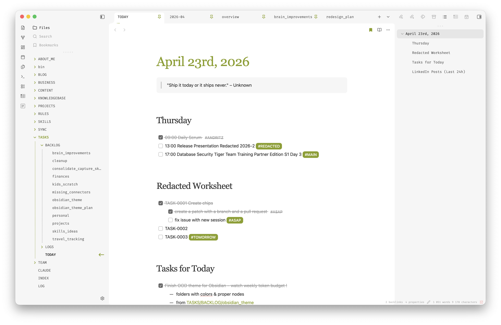

# One Oracle Developer

An Obsidian theme tuned for long-form technical writing, tight note taxonomies, and daily use by a developer who lives in the editor. Built on top of the excellent [Baseline](https://github.com/aaaaalexis/obsidian-baseline) theme, with opinionated typography and a few quality-of-life fixes on top.

Now a human version from me:

> I checked all themes in Obsidian, and 95% of them were total garbage. Baseline was almost perfect, but I had to make a few small tweaks here and there so it works better with lists, checklists, and tags. I also adjusted the headers and fonts. The biggest issue was the folders/files tree, which felt a bit dull. Install Baseline and this theme and compare them yourself.
>
> More details (generated) below. Enjoy!

 

## Preview

## What's different from Baseline

- **Serif headings.** H1–H6 use Source Serif Pro / Instrument Serif with explicit sizes (3 / 2 / 1.75 / 1.5 / 1.25 / 1 rem), weight 500, line-height 1.35. Headings read like a book, not a UI component.
- **Readable strikethrough.** Completed tasks, `<del>`, and `<s>` render in grey (#999) so struck text stays legible instead of disappearing into the background.
- **Visible struck tags.** Tags inside completed tasks keep a grey foreground so `#project` doesn't vanish after you tick the checkbox.
- **Accent tag pills.** Tags render as solid accent-coloured pills with white text – easier to scan than the default outline style.
- **Everything Baseline already does well.** Colour system, spacing scale, Style Settings integration, light/dark support – all untouched.

## Install

### Manual

1. Download or clone this folder.
2. Copy the `One Oracle Developer` folder into your vault at `.obsidian/themes/`.
3. In Obsidian: `Settings → Appearance → Themes → One Oracle Developer`.

## Requirements

- Obsidian 1.6.0 or newer.
- Works in both light and dark modes.
- [Style Settings](https://github.com/mgmeyers/obsidian-style-settings) plugin recommended (inherited from Baseline) for colour and typography tweaks.

## Fonts

Headings use Source Serif Pro with Instrument Serif as a fallback. Install one of them for the intended look; otherwise the system serif takes over, which is fine but less refined.

## Author

[Jan Kvetina](http://www.jankvetina.cz) – Oracle APEX developer, blogger at [oneoracledeveloper.com](https://www.oneoracledeveloper.com).

### Credits

This theme is a fork of [Baseline](https://github.com/aaaaalexis/obsidian-baseline) by [aaaaalexis](https://github.com/aaaaalexis). All the structural work – the colour system, the Style Settings schema, the light/dark balance – comes from there. This fork only layers personal typography choices and a few rendering fixes on top. If you like the bones of this theme, go star Baseline.

## License

MIT. Baseline is also MIT; this fork inherits the same terms.
